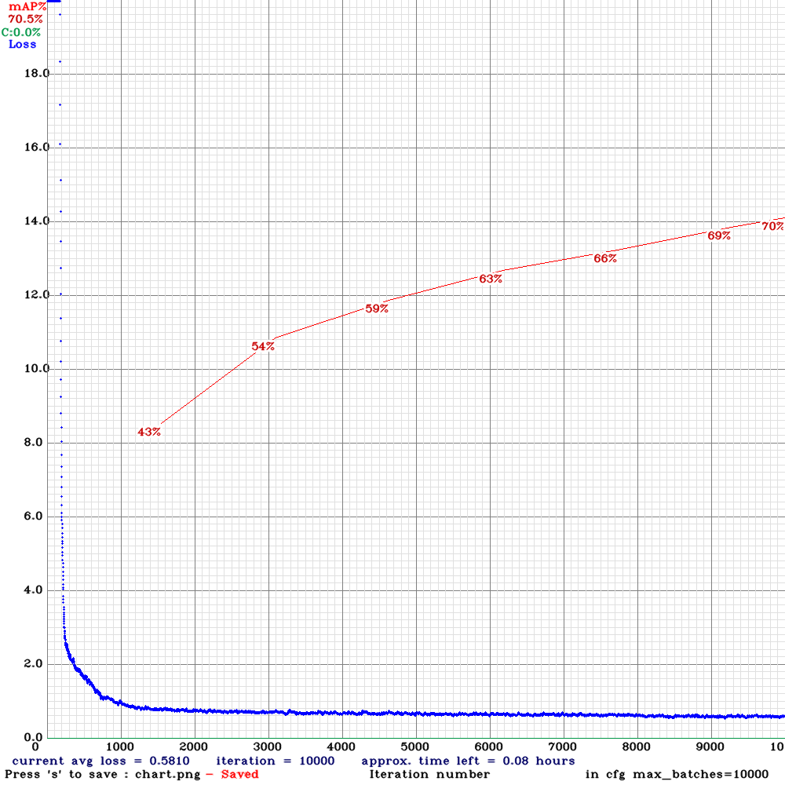
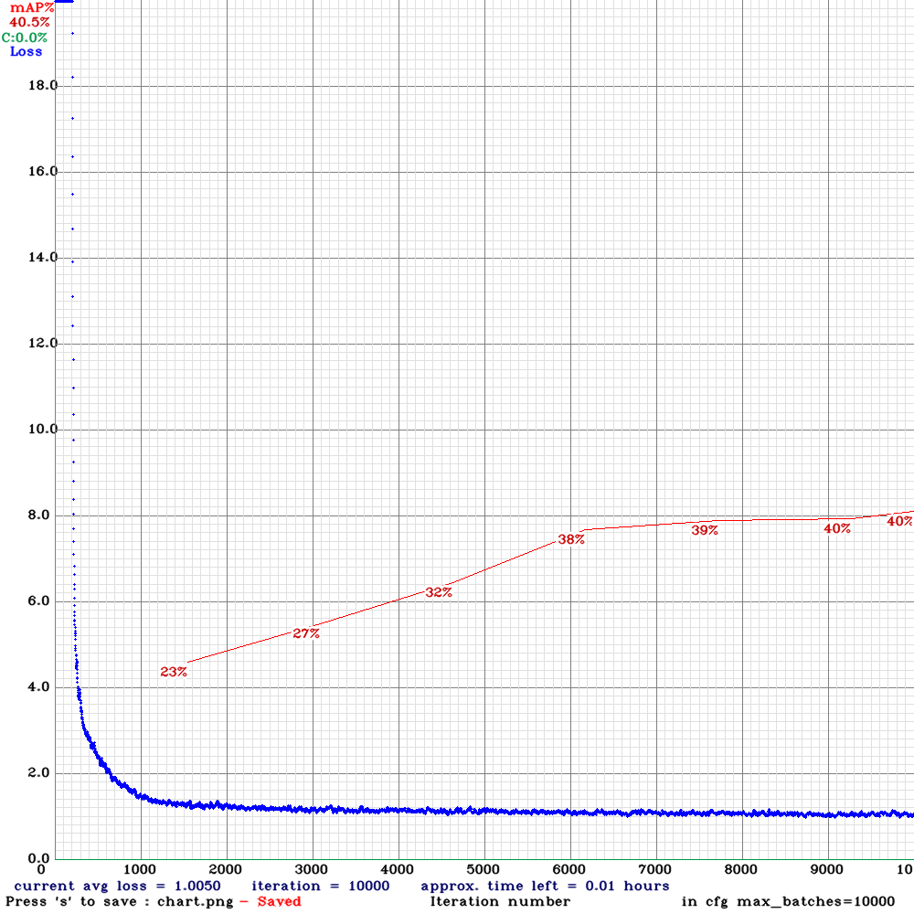

# Tutorial

1. You need to download related .weights file and .cfg file.

| model | dataset | download |
| :- | :- | :- |
| Yolov3 | WIDER FACE | [BaiduNetDisk(cnl4)](https://pan.baidu.com/s/1yCAgeXKrXq4PbITa1h1yJw) |
| Yolov3 | TV-hand & COCO-hand | [BaiduNetDisk(kvzt)](https://pan.baidu.com/s/1fJVdm6CvqCkNBBkAOdpO8w) |
| Yolov3-tiny | WIDER FACE | [BaiduNetDisk(58kn)](https://pan.baidu.com/s/1q0zHTM_IajQ-1wW5hhFIuw) |
| Yolov3-tiny | TV-hand & COCO-hand | [BaiduNetDisk(6guf)](https://pan.baidu.com/s/1RLpchgKZ9wo6j5_6K0yOSg) |

2. You'd better put those downloaded weights file into config/.
3. Run python command: `python detect.py [model_config_path] [classes_name_path] [checkpoint_path] `  
4. We will not use GPU by default. If you want use GPU to boost your model training or inference, you can set `--cuda`. Run python command: `python detect.py [model_config_path] [classes_name_path] [checkpoint_path]  --cuda`  
5. We acquire image input from camera number 0 by default. If you want get image from other camera, you can set `--video 1`.
6. If you want to input image from file path, you can set `--image [file_path]`.

e.g.
```
python detect.py config/yolov3_wider.cfg config/wider.names config/yolov3_wider.weights # CPU mode  
python detect.py config/yolov3_wider.cfg config/wider.names config/yolov3_wider.weights --cuda # GPU mode  
```

## Training curve

### Hand detection

Yolov3:



Yolov3-tiny:



